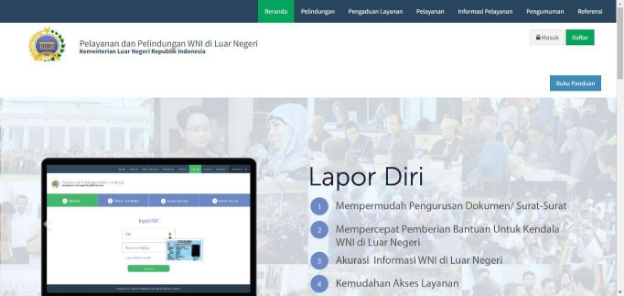
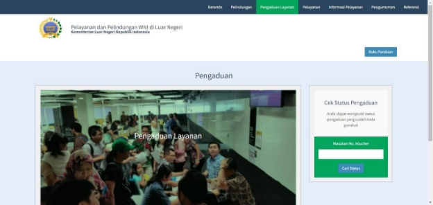
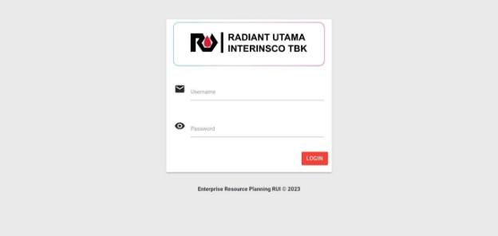
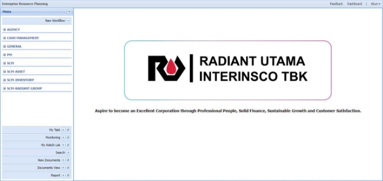
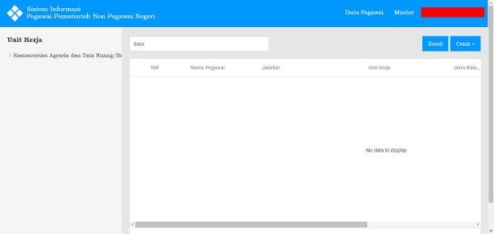
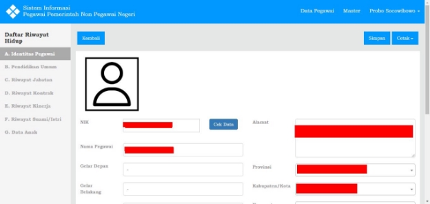

**PORTOFOLIO** 

1. Peduli WNI – Kementerian Luar Negeri 

   Sistem aplikasi berbasis WEB untuk pendataan WNI diluar negeri dan untuk memudahkan para WNI untuk melakukan layanan yang biasanya dilakukan di perwakilan setiap negara secara online atau booking online. 

2. ERP – PT Radiant Utama Inerinsco tbk 

   Sistem aplikasi berbasis WEB dengan konsep ERP (Enterpreneur Resource Plannin), sistem dengan model konfigurasi sehingga dapat membuat modul-modul aplikasi sesuai kebutuhan perusahaan. 

3. SDM Pegawai Pemerintah Non Pegawai - Kementerian Agraria dan Tata Ruang/Badan Pertanahan Nasional 

   Sistem aplikasi berbasis web untuk pendataan pegawai non pemerintah di Kementrian Agraria dan Tata Ruang/Badan Pertahanan Nasional. Pendataan data indentitas dan data history pegawai. 

4. Sistem Presensi & Tunjangan Pegawai - Kementrian Pemuda dan Olahraga 

   Sistem aplikasi berbasis web untuk pengelolaan data presensi dan perhitungan tunjangan pegawai. 

